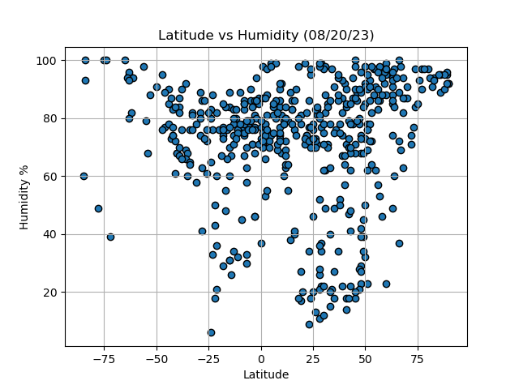

# Weather API Visualization

In this project I used OpenWeatherMap API to visualize weather data by latitude. The process includes generating a set of 500 random latitudes and longitudes, using citipy to find the nearest city for each point, and then querying the OpenWeatherMap API to retrieve current weather data, including temperature, humidity, cloudiness, and windspeed. The data is used to create linear regressions to predict relationships for all four weather parameters compared to latitudes, for both the northern and southern hemispheres. In total, there are eight linear regression analyses performed.

## Plots and Descriptions

### Lat_vs_Temp.png

Latitudes closer to the equator tend to have higher temperatures and vice versa.

### Lat_vs_Humidity.png

There is a general trend of latitudes further from the equator having higher humidity on average, with a few outliers.

### Lat_vs_Cloudiness.png

No observable correlation between latitude and cloudiness.

### Lat_vs_Windspeed.png

Cities further from the equator are slightly more likely to have higher wind speeds today, especially in the southern hemisphere.

### North_Lat_vs_Temp_Regression.png

In this plot, the red line represents the linear regression trained on the latitude and temperature data from today. It predicts that cities further north from the equator are more likely to have lower temperatures.

### South_Lat_vs_Temp_Regress.png

Cities further south from the equator are more likely to have lower temperatures. The relationship gets more extreme below -65 latitude.

### North_Lat_vs_Humidity_Regress.png

Average humidity increases slightly the further north a city is from the equator.

### South_Lat_vs_Humidity_Regress.png

Average humidity increases slightly the further south a city is from the equator.

### North_Lat_vs_Cloud_Regress.png

No significant relationship is apparent between northern latitudes and cloudiness today. Several cities between 20 and 60 latitude experienced 0% clouds, while cities throughout the northern hemisphere experienced 100% clouds.

### South_Lat_vs_Cloud_Regress.png

Today, cities further south from the equator were more likely to experience cloudiness.

### North_Lat_vs_Wind_Regress.png

No strong relationship today between wind speed and latitude.

### South_Lat_vs_Wind_Regress.png

Today, cities further south of the equator were more likely to experience higher wind speeds.

